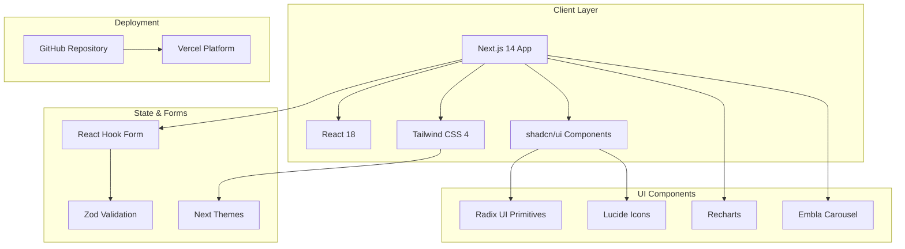

# Sketchpad - shadcn/ui theme

*Automatically synced with your [v0.app](https://v0.app) deployments*

[](https://vercel.com/gileb64375-5584s-projects/v0-sketchpad-shadcn-ui-theme)
[](https://v0.app/chat/projects/wkuKkbxMuTR)
[](https://nextjs.org)
[](https://www.typescriptlang.org)
[](https://tailwindcss.com)

---

## Overview

This repository will stay in sync with your deployed chats on [v0.app](https://v0.app). Any changes you make to your deployed app will be automatically pushed to this repository from [v0.app](https://v0.app).

---

## System Architecture



---

## Tech Stack

| Category | Technology | Version |
|----------|------------|---------|
| **Framework** | Next.js | 14.2.16 |
| **Language** | TypeScript | ^5 |
| **UI Library** | React | ^18 |
| **Styling** | Tailwind CSS | ^4.1.9 |
| **Components** | shadcn/ui | Latest |
| **Icons** | Lucide React | ^0.454.0 |
| **Forms** | React Hook Form | ^7.60.0 |
| **Validation** | Zod | 3.25.67 |
| **Charts** | Recharts | Latest |
| **Animations** | Framer Motion | Latest |

---

## Features

- **Modern UI Components** - Built with shadcn/ui using Radix UI primitives
- **Dark/Light Mode** - Theme switching with next-themes
- **Responsive Design** - Mobile-first approach with Tailwind CSS 4
- **Form Handling** - Type-safe forms with React Hook Form + Zod validation
- **Rich Data Visualization** - Charts powered by Recharts
- **Accessibility** - ARIA-compliant components via Radix UI
- **Animations** - Smooth transitions and micro-interactions
- **Command Palette** - Fast navigation with cmdk
- **Toast Notifications** - Modern toast system with sonner

---

## Configuration

### Tailwind CSS 4

```javascript
// tailwind.config.ts
{
  theme: {
    extend: {
      colors: {
        border: "hsl(var(--border))",
        input: "hsl(var(--input))",
        ring: "hsl(var(--ring))",
        background: "hsl(var(--background))",
        foreground: "hsl(var(--foreground))",
        primary: {
          DEFAULT: "hsl(var(--primary))",
          foreground: "hsl(var(--primary-foreground))",
        },
        secondary: {
          DEFAULT: "hsl(var(--secondary))",
          foreground: "hsl(var(--secondary-foreground))",
        },
        destructive: {
          DEFAULT: "hsl(var(--destructive))",
          foreground: "hsl(var(--destructive-foreground))",
        },
        muted: {
          DEFAULT: "hsl(var(--muted))",
          foreground: "hsl(var(--muted-foreground))",
        },
        accent: {
          DEFAULT: "hsl(var(--accent))",
          foreground: "hsl(var(--accent-foreground))",
        },
        popover: {
          DEFAULT: "hsl(var(--popover))",
          foreground: "hsl(var(--popover-foreground))",
        },
        card: {
          DEFAULT: "hsl(var(--card))",
          foreground: "hsl(var(--card-foreground))",
        },
      },
      borderRadius: {
        lg: "var(--radius)",
        md: "calc(var(--radius) - 2px)",
        sm: "calc(var(--radius) - 4px)",
      },
    },
  },
}
```

### PostCSS Configuration

```javascript
// postcss.config.mjs
export default {
  plugins: {
    "@tailwindcss/postcss": {},
    autoprefixer: {},
  },
}
```

---

## Installed Packages

### Dependencies

| Package | Version | Description |
|---------|---------|-------------|
| `@radix-ui/*` | 1.x | UI primitives (dialog, dropdown, etc.) |
| `@tanstack/react-table` | latest | Table/data grid component |
| `class-variance-authority` | ^0.7.1 | Class name variance utility |
| `clsx` | ^2.1.1 | Conditional class names |
| `cmdk` | 1.0.4 | Command palette |
| `date-fns` | latest | Date utility functions |
| `embla-carousel-react` | 8.5.1 | Carousel component |
| `geist` | ^1.3.1 | Font family |
| `input-otp` | 1.4.1 | OTP input component |
| `next-themes` | ^0.4.6 | Theme management |
| `react-day-picker` | 9.8.0 | Date picker |
| `react-resizable-panels` | ^2.1.7 | Resizable panels |
| `sonner` | ^1.7.4 | Toast notifications |
| `tailwind-merge` | ^2.5.5 | Tailwind class merge |
| `tailwindcss-animate` | ^1.0.7 | Animation utilities |
| `vaul` | ^0.9.9 | Drawer component |

### Dev Dependencies

| Package | Version | Description |
|---------|---------|-------------|
| `@tailwindcss/postcss` | ^4.1.9 | PostCSS plugin for Tailwind |
| `@types/node` | ^22 | Node.js types |
| `@types/react` | ^18 | React types |
| `@types/react-dom` | ^18 | React DOM types |
| `postcss` | ^8.5 | CSS transformation |
| `tailwindcss` | ^4.1.9 | Utility-first CSS |
| `tw-animate-css` | 1.3.3 | Animation library |
| `typescript` | ^5 | TypeScript compiler |

---

## Getting Started

### Prerequisites

- **Node.js** 18.x or higher
- **npm** 9.x or higher

### Installation

```bash
# Clone the repository
git clone <repository-url>

# Navigate to project directory
cd sketchpad-shadcn-ui-theme

# Install dependencies
npm install

# Start development server
npm run dev
```

### Development Commands

| Command | Description |
|---------|-------------|
| `npm run dev` | Start development server |
| `npm run build` | Build for production |
| `npm run start` | Start production server |
| `npm run lint` | Run ESLint |

### Environment Variables

Create a `.env.local` file in the root directory:

```env
# Analytics (optional)
NEXT_PUBLIC_ANALYTICS_ID=your-analytics-id

# Add other environment variables as needed
```

---

## Project Structure

```
sketchpad-shadcn-ui-theme/
├── app/                    # Next.js App Router
│   ├── layout.tsx          # Root layout
│   ├── page.tsx            # Home page
│   └── globals.css         # Global styles
├── components/             # React components
│   ├── ui/                 # shadcn/ui components
│   └── ...
├── lib/                    # Utilities
│   ├── utils.ts            # Helper functions
│   └── ...
├── public/                 # Static assets
├── package.json            # Dependencies
├── tailwind.config.ts      # Tailwind configuration
├── tsconfig.json           # TypeScript config
└── next.config.mjs         # Next.js config
```

---

## Deployment

Your project is live at:

**[https://vercel.com/gileb64375-5584s-projects/v0-sketchpad-shadcn-ui-theme](https://vercel.com/gileb64375-5584s-projects/v0-sketchpad-shadcn-ui-theme)**

### Build for Production

```bash
npm run build
```

The built application will be in the `.next` directory, ready for deployment to Vercel or any Node.js hosting platform.

---

## How It Works

1. **Create & Modify** - Build your project using [v0.app](https://v0.app)
2. **Deploy** - Deploy your chats from the v0 interface
3. **Auto-Sync** - Changes are automatically pushed to this repository
4. **CDN** - Vercel deploys the latest version from this repository

---

## License

MIT License - Feel free to use this project for your own purposes.

---

## Resources

- [Next.js Documentation](https://nextjs.org/docs)
- [shadcn/ui](https://ui.shadcn.com)
- [Tailwind CSS](https://tailwindcss.com)
- [Radix UI](https://www.radix-ui.com)
- [v0.app](https://v0.app)