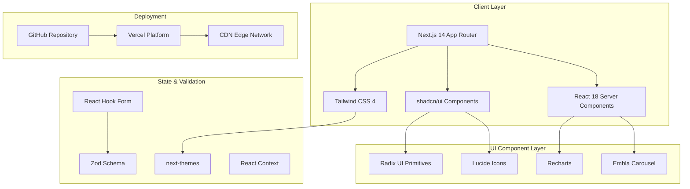

# Sketchpad - shadcn/ui Theme

> A modern, responsive web application built with Next.js 14, React 18, Tailwind CSS 4, and shadcn/ui components. Features dark/light mode, accessibility-first design, and premium UI components.

[](https://vercel.com/gileb64375-5584s-projects/v0-sketchpad-shadcn-ui-theme)
[](https://v0.app/chat/projects/wkuKkbxMuTR)
[](https://nextjs.org)
[](https://www.typescriptlang.org)
[](https://tailwindcss.com)

---

## Overview

> **Sketchpad** is a modern dashboard application featuring comprehensive UI components built with shadcn/ui and Tailwind CSS 4. This project demonstrates best practices for building accessible, responsive, and themeable web applications.

**Key Highlights:**
- Modern UI components built with shadcn/ui using Radix UI primitives
- Full dark/light mode support with next-themes
- Responsive design with mobile-first approach
- Type-safe forms with React Hook Form + Zod
- Rich data visualization with Recharts

This repository stays in sync with your deployed chats on [v0.app](https://v0.app). Any changes you make to your deployed app will be automatically pushed to this repository.

---

## System Architecture



---

## Tech Stack

| Category | Technology | Version | Status |
|----------|------------|---------|--------|
| **Framework** | Next.js | 14.2.16 | ✅ Stable |
| **Language** | TypeScript | ^5 | ✅ Stable |
| **UI Library** | React | ^18 | ✅ Stable |
| **Styling** | Tailwind CSS | ^4.1.9 | ✅ Latest |
| **Components** | shadcn/ui | Latest | ✅ Active |
| **Icons** | Lucide React | ^0.454.0 | ✅ Latest |
| **Forms** | React Hook Form | ^7.60.0 | ✅ Latest |
| **Validation** | Zod | 3.25.67 | ✅ Latest |
| **Charts** | Recharts | Latest | ✅ Active |
| **Animations** | tw-animate-css | 1.3.3 | ✅ Active |
| **Theme** | next-themes | ^0.4.6 | ✅ Active |

---

## Features

> **Core Features:**

- **Modern UI Components** - Built with shadcn/ui using Radix UI primitives for accessibility
- **Dark/Light Mode** - Theme switching with system preference detection via `next-themes`
- **Responsive Design** - Mobile-first approach with Tailwind CSS 4
- **Form Handling** - Type-safe forms with React Hook Form + Zod validation
- **Rich Data Visualization** - Charts powered by Recharts (Line, Area, Bar charts)
- **Accessibility** - ARIA-compliant components via Radix UI
- **Smooth Animations** - Micro-interactions with tw-animate-css
- **Command Palette** - Fast navigation with cmdk
- **Toast Notifications** - Modern toast system with sonner
- **Responsive Tables** - Data tables with @tanstack/react-table
- **Calendar Component** - Date picker with react-day-picker
- **OTP Input** - Secure input with input-otp

> **Advanced Components:**

- Dialog & Drawer (vaul)
- Dropdown Menu
- Popover & Hover Card
- Select & Combobox
- Switch & Toggle
- Slider & Progress
- Avatar & Badge
- Calendar & Date Picker
- Tabs & Accordion
- Alert Dialog & Confirmation
- Scroll Area
- Resizable Panels

---

## Stats

| Metric | Value |
|--------|-------|
| **Total Components** | 30+ shadcn/ui |
| **Radix Primitives** | 25+ |
| **Chart Types** | 5+ |
| **Bundle Size** | ~298 KB |
| **First Load JS** | ~87.2 KB |
| **Static Routes** | 6 |
| **Build Time** | ~2s |

---

## Configuration

### Tailwind CSS 4 Configuration

```javascript
// app/globals.css - CSS Variables
@theme inline {
  --color-background: var(--background);
  --color-foreground: var(--foreground);
  --color-primary: var(--primary);
  --color-secondary: var(--secondary);
  --color-muted: var(--muted);
  --color-accent: var(--accent);
  --color-destructive: var(--destructive);
  --color-border: var(--border);
  --color-input: var(--input);
  --color-ring: var(--ring);
  --color-card: var(--card);
  --color-popover: var(--popover);
  --color-chart-1: var(--chart-1);
  --color-chart-2: var(--chart-2);
  --color-chart-3: var(--chart-3);
  --color-chart-4: var(--chart-4);
  --color-chart-5: var(--chart-5);
  --radius-sm: var(--radius-sm);
  --radius-md: var(--radius-md);
  --radius-lg: var(--radius-lg);
  --radius-xl: var(--radius-xl);
  --shadow-xs: var(--shadow-xs);
  --shadow-sm: var(--shadow-sm);
  --shadow-md: var(--shadow-md);
  --shadow-lg: var(--shadow-lg);
  --shadow-xl: var(--shadow-xl);
}
```

### Color Palette (OKLCH)

| Token | Light Mode | Dark Mode |
|-------|-----------|-----------|
| `--background` | `oklch(0.9721 0.0158 110.5501)` | `oklch(0.145 0.014 285.5)` |
| `--foreground` | `oklch(0.5066 0.2501 271.8903)` | `oklch(0.92 0.004 286.5)` |
| `--primary` | `oklch(0.5066 0.2501 271.8903)` | `oklch(0.92 0.004 286.5)` |
| `--secondary` | `oklch(1 0 0)` | `oklch(0.22 0.018 285.5)` |
| `--muted` | `oklch(0.9189 0.0147 106.6853)` | `oklch(0.22 0.018 285.5)` |
| `--accent` | `oklch(0.9168 0.0214 109.7161)` | `oklch(0.22 0.018 285.5)` |
| `--destructive` | `oklch(0.63 0.19 23.03)` | `oklch(0.577 0.159 27.325)` |
| `--border` | `oklch(0.5066 0.2501 271.8903)` | `oklch(0.303 0.014 286.5)` |

### shadcn/ui Configuration

```json
{
  "$schema": "https://ui.shadcn.com/schema.json",
  "style": "new-york",
  "rsc": true,
  "tsx": true,
  "tailwind": {
    "config": "",
    "css": "app/globals.css",
    "baseColor": "neutral",
    "cssVariables": true,
    "prefix": ""
  },
  "aliases": {
    "components": "@/components",
    "utils": "@/lib/utils",
    "ui": "@/components/ui",
    "lib": "@/lib",
    "hooks": "@/hooks"
  },
  "iconLibrary": "lucide"
}
```

### PostCSS Configuration

```javascript
// postcss.config.mjs
export default {
  plugins: {
    "@tailwindcss/postcss": {},
    autoprefixer: {},
  },
}
```

---

## Installed Packages

### Production Dependencies

| Package | Version | Description |
|---------|---------|-------------|
| `@radix-ui/*` | 1.x | UI primitives (dialog, dropdown, popover, etc.) |
| `@tanstack/react-table` | latest | Table/data grid component |
| `class-variance-authority` | ^0.7.1 | Class name variance utility |
| `clsx` | ^2.1.1 | Conditional class names |
| `cmdk` | 1.0.4 | Command palette |
| `date-fns` | latest | Date utility functions |
| `embla-carousel-react` | 8.5.1 | Carousel component |
| `geist` | ^1.3.1 | Font family |
| `input-otp` | 1.4.1 | OTP input component |
| `next-themes` | ^0.4.6 | Theme management |
| `react-day-picker` | 9.8.0 | Date picker |
| `react-resizable-panels` | ^2.1.7 | Resizable panels |
| `sonner` | ^1.7.4 | Toast notifications |
| `tailwind-merge` | ^2.5.5 | Tailwind class merge |
| `tailwindcss-animate` | ^1.0.7 | Animation utilities |
| `vaul` | ^0.9.9 | Drawer component |

### Dev Dependencies

| Package | Version | Description |
|---------|---------|-------------|
| `@tailwindcss/postcss` | ^4.1.9 | PostCSS plugin for Tailwind |
| `@types/node` | ^22 | Node.js types |
| `@types/react` | ^18 | React types |
| `@types/react-dom` | ^18 | React DOM types |
| `postcss` | ^8.5 | CSS transformation |
| `tailwindcss` | ^4.1.9 | Utility-first CSS |
| `tw-animate-css` | 1.3.3 | Animation library |
| `typescript` | ^5 | TypeScript compiler |

---

## Getting Started

### Prerequisites

> **Required:**
- Node.js `18.x` or higher
- npm `9.x` or higher
- Git

> **Recommended:**
- VS Code with extensions: ESLint, Prettier, Tailwind CSS IntelliSense

### Installation

```bash
# 1. Clone the repository
git clone <repository-url>

# 2. Navigate to project directory
cd sketchpad-shadcn-ui-theme

# 3. Install dependencies
npm install
# or using pnpm
pnpm install

# 4. Start development server
npm run dev
```

### Development Commands

| Command | Description | Output |
|---------|------------|--------|
| `npm run dev` | Start development server | `http://localhost:3000` |
| `npm run build` | Build for production | `.next/` directory |
| `npm run start` | Start production server | `http://localhost:3000` |
| `npm run lint` | Run ESLint | Console output |

### Environment Variables

> Create a `.env.local` file in the root directory:

```env
# Analytics (optional)
NEXT_PUBLIC_ANALYTICS_ID=your-analytics-id

# Add other environment variables as needed
```

---

## Project Structure

```
sketchpad-shadcn-ui-theme/
├── app/                         # Next.js App Router
│   ├── layout.tsx              # Root layout with ThemeProvider
│   ├── page.tsx               # Home page
│   ├── globals.css            # Global styles with CSS variables
│   ├── sitemap.ts            # Sitemap
│   └── robots.ts             # Robots.txt
├── components/                  # React components
│   ├── ui/                  # shadcn/ui components (30+)
│   │   ├── button.tsx
│   │   ├── card.tsx
│   │   ├── chart.tsx
│   │   ├── dialog.tsx
│   │   ├── dropdown-menu.tsx
│   │   └── ...
│   └── theme-provider.tsx     # Theme wrapper
├── lib/                       # Utilities
│   ├── utils.ts             # clsx, tailwindMerge helpers
├── public/                    # Static assets
│   ├── manifest.json       # PWA manifest
│   └── placeholder.*      # Placeholder assets
├── styles/
│   └── globals.css        # Global styles
├── package.json           # Dependencies
├── tsconfig.json          # TypeScript config
├── postcss.config.mjs     # PostCSS config
└── tailwind.config.*     # Tailwind config (if needed)
```

---

## Usage Examples

### Using Components

```tsx
import { Button } from "@/components/ui/button"
import { Card, CardHeader, CardTitle } from "@/components/ui/card"

export function MyComponent() {
  return (
    <Card>
      <CardHeader>
        <CardTitle>Hello World</CardTitle>
      </CardHeader>
      <Button>Click Me</Button>
    </Card>
  )
}
```

### Using Charts

```tsx
import { LineChart, Line } from "recharts"
import { ChartContainer, ChartTooltip } from "@/components/ui/chart"

const data = [
  { name: "Mon", value: 100 },
  { name: "Tue", value: 200 },
]

export function MyChart() {
  return (
    <ChartContainer config={chartConfig}>
      <LineChart data={data}>
        <Line dataKey="value" />
        <ChartTooltip />
      </LineChart>
    </ChartContainer>
  )
}
```

### Theme Toggle

```tsx
import { useTheme } from "next-themes"
import { Button } from "@/components/ui/button"
import { MoonIcon, SunIcon } from "lucide-react"

export function ThemeToggle() {
  const { theme, setTheme } = useTheme()

  return (
    <Button variant="outline" onClick={() => setTheme(theme === "dark" ? "light" : "dark")}>
      <SunIcon className="hidden dark:block" />
      <MoonIcon className="dark:hidden" />
    </Button>
  )
}
```

---

## Deployment

> **Live URL:**
> **[https://vercel.com/gileb64375-5584s-projects/v0-sketchpad-shadcn-ui-theme](https://vercel.com/gileb64375-5584s-projects/v0-sketchpad-shadcn-ui-theme)**

### Build for Production

```bash
npm run build
```

The built application will be in the `.next` directory, ready for deployment to Vercel or any Node.js hosting platform.

### Deployment Platforms

- **Vercel** (Recommended) - Zero-config deployment
- **Netlify** - Drag & drop deployment
- **Railway** - Docker-based deployment
- **AWS** - Custom deployment with EC2/Docker

---

## How It Works

1. **Create & Modify** - Build your project using [v0.app](https://v0.app)
2. **Deploy** - Deploy your chats from the v0 interface
3. **Auto-Sync** - Changes are automatically pushed to this repository
4. **CDN** - Vercel deploys the latest version from this repository

---

## License

> **MIT License** - Feel free to use this project for your own purposes.

---

## Resources

| Resource | Link |
|----------|------|
| Next.js Docs | https://nextjs.org/docs |
| shadcn/ui | https://ui.shadcn.com |
| Tailwind CSS | https://tailwindcss.com |
| Radix UI | https://www.radix-ui.com |
| v0.app | https://v0.app |
| TypeScript | https://www.typescriptlang.org |

---

## Contributing

> **Contributions are welcome!** Please feel free to submit a Pull Request or create an Issue.

---

## Credits

- Built with [v0.app](https://v0.app)
- UI Components by [shadcn/ui](https://ui.shadcn.com)
- Deployed on [Vercel](https://vercel.com)